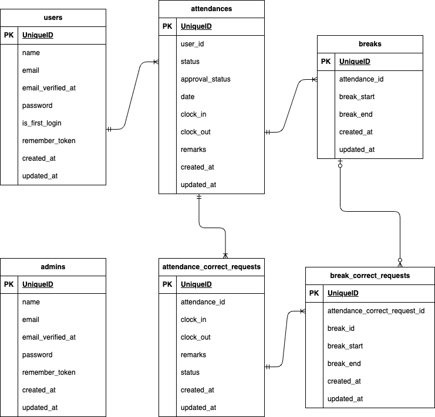

# coachtech 勤怠管理アプリ

## 環境構築

1. `git clone git@github.com:kobasikibo/coachtech-attendance-management-app.git`
   `cd coachtech-attendance-management-app`

2. .env.exampleファイルから.envを作成し、環境変数を変更
``` sh
cp .env.example .env
```
``` text
APP_TIMEZONE=Asia/Tokyo

APP_LOCALE=ja
APP_FALLBACK_LOCALE=ja
APP_FAKER_LOCALE=ja_JP

DB_CONNECTION=mysql
DB_HOST=mysql
DB_PORT=3306
DB_DATABASE=laravel_db
DB_USERNAME=laravel_user
DB_PASSWORD=laravel_pass

SESSION_DRIVER=file

CACHE_DRIVER=file
```
3. Laravelパッケージのインストール
``` sh
docker compose run --rm php composer install
```
4. コンテナをビルド・起動
``` sh
docker compose up -d --build
```
5. Laravelアプリケーションの初期設定
``` sh
docker compose exec php sh
php artisan key:generate
php artisan migrate --seed
```

**Fortifyの設定**
1. `docker compose exec php sh`
2. `composer require laravel/fortify`

**Mailhogの設定**
1. Mailhogを使用するため、.envの環境変数を変更
``` text
MAIL_MAILER=smtp
MAIL_HOST=mailhog
MAIL_PORT=1025
MAIL_USERNAME=null
MAIL_PASSWORD=null
MAIL_ENCRYPTION=null
MAIL_FROM_ADDRESS=noreply@example.com
MAIL_FROM_NAME="${APP_NAME}"
```

## 使用技術(実行環境)
- PHP8.3.11
- Laravel11.23.5
- MySQL9.1.0

## ER図


## URL
- 開発環境: http://localhost/
- phpMyAdmin: http://localhost:8081/
- MailhogのWebインターフェース: http://localhost:8025/
